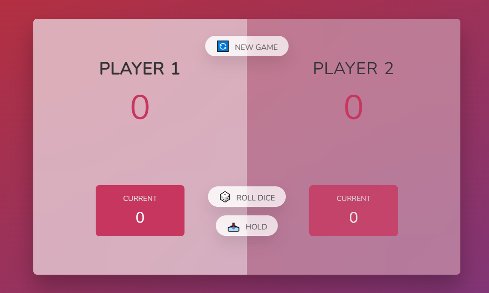

# Pig Game

## Overview
**Pig Game** is a web application designed for two players. In this game, players take turns rolling dice, accumulating scores, and trying to reach 100 points first. However, if a player rolls a 1, they lose their accumulated score for that turn!

## Features
- Two-player gameplay
- Dice rolling mechanics
- Scorekeeping with the option to hold scores at any time

## Usage
1. Open the game in your web browser.
2. Take turns rolling the dice.
3. Accumulate points and decide when to hold your score. Avoid rolling a 1!
4. The first player to reach 100 points wins!

